# agent-md-specs

> A proposed open standard for AI agent identity, governance, and
> accountability — bridging human-readable policy with machine-enforceable
> Zero Trust security schemas. CC0 public domain.

[](https://creativecommons.org/publicdomain/zero/1.0/)
[](./INDEX.md)
[](./INDEX.md)
[](./INDEX.md)
[](https://totalmarkdown.ai)

**Created and maintained by TotalMarkdown.ai**
**[→ Start Here](_start-here/)**
&nbsp;·&nbsp; License: [CC0 1.0 Universal](./LICENSE) — Public Domain
&nbsp;·&nbsp; [Discussions](https://github.com/totalmarkdown/agent-md-specs/discussions)
&nbsp;·&nbsp; [Contributing](./CONTRIBUTING.md)
&nbsp;·&nbsp; [Full Index](./INDEX.md)
&nbsp;·&nbsp; [JSON Schemas](./schemas/)
&nbsp;·&nbsp; [Spec Lifecycle](./SPEC_LIFECYCLE.md)
&nbsp;·&nbsp; [NIST Crosswalk](./NIST_CROSSWALK.md)
&nbsp;·&nbsp; [Guide for NCCoE Submission Reviewers](./NIST_SUBMISSION_GUIDE.md)

_Mapped to the [NIST AI RMF (AI 100-1)](https://www.nist.gov/artificial-intelligence)
and submitted as a public comment on the [NCCoE concept paper on AI Agent Identity and Authorization](https://www.nist.gov/caisi/ai-agent-standards-initiative) (February 2026). Submission does not imply NIST review, endorsement, or affiliation._

---

## Markdown Is Becoming the Universal Language of AI Agents

Across the AI industry, **Markdown has become the common way humans
configure AI agents** — not JSON, not YAML, not proprietary config
files. Plain Markdown, the same format developers already use for
README.md, is how the world's leading AI platforms define what agents
should do, how they should behave, and what they're allowed to access.

| Platform | Markdown File | What It Configures | Scale |
|----------|--------------|-------------------|-------|
| OpenAI Codex | `AGENTS.md` | Project instructions for coding agents | 67,000+ repos, AAIF standard |
| Anthropic Claude Code | `CLAUDE.md` | Agent behavior in codebases | Ecosystem standard |
| Anthropic Claude Code | `SKILL.md` | Reusable agent capabilities | Ecosystem standard |
| GitHub Copilot | `.agent.md` | Custom agent definitions in VS Code / Visual Studio | Native IDE integration |
| Karpathy autoresearch | `program.md` | Autonomous ML research agent | 59,000+ stars |
| Cursor | `.cursorrules` | Editor AI behavior rules | Ecosystem standard |
| Google Gemini CLI | `GEMINI.md` | Agent project context | Ecosystem standard |

Visual Studio Magazine stated it directly: **"Markdown is becoming the
human-readable contract for agent behavior."** Microsoft is investing
in Markdown as an in-IDE governance surface — Visual Studio 2026 treats
`.agent.md` files as first-class agent definitions, and VS Code
auto-injects `AGENTS.md` into every Copilot chat session.

The pattern is clear: **Markdown files are the interface layer between
humans and AI agents.** But every platform invented its own vocabulary.
AGENTS.md handles project instructions. CLAUDE.md handles coding behavior.
program.md handles research workflows. None of them address the questions
that enterprise, compliance, and security teams are now asking:

*Who is this agent? Who authorized it? What will it never do? How do
we prove what it did when something goes wrong?*

**agent-md-specs answers these questions.** A collection of Markdown file type
specifications covering every dimension of agent governance — from
identity and delegation to audit trails and memory safety. The same
human-readable format the industry already chose, extended into the
governance, compliance, and accountability dimensions that production
deployments require.

---

## What Is agent-md-specs?

**5 files to start, 47 Core for production, 132 Extended when you need them.**
179 Markdown spec types total across 17 categories — all CC0 public domain.

The 47 Core specifications cover AI agent identity, governance, and
accountability. The 132 Extended specifications cover the full lifecycle
from personality to regulatory compliance. Every spec is human-readable
Markdown with YAML frontmatter that any runtime can parse.

agent-md-specs defines a declarative vocabulary layer that sits
between human-readable policy definition and machine-enforceable
runtime controls — covering identity, authorization, safety
boundaries, audit trails, shared memory governance, failure
containment, and regulatory compliance.

```
From first awakening   (HELLOWORLD.md)   to retirement      (LEGACY.md)
From personality       (SOUL.md)         to audit trail     (AUDITTRAIL.md)
From emergency stops   (ICE.md)          to shared memory   (SHAREDCONTEXT.md)
From who authorized it (DELEGATION.md)   to did it comply   (ENFORCEMENT.md)
```

47 Core + 132 Extended specs. 179 total file types. 16 volumes. 17 categories.

Whether configuring a single agent or orchestrating a fleet of
hundreds — from individual identity (WHOAMI.md) to team coordination
(TEAM.md) to organization-wide policies (ORG.md) — every level of
the agent hierarchy is covered.

---

## Why Does This Exist?

In 2024, developers asked: *"What can this AI do?"* By 2026 the
question had shifted to *"How do I work with this agent?"* As agents
begin working in teams — or across departments for large organisations —
the questions multiply: *Who coordinates them? How do they share context
safely? What happens when one agent in a team fails?*

This library builds the vocabulary for those questions. The agents
that will matter aren't the ones with the best models — they're the
ones with the best governance, the most honest documentation of their
boundaries, and provable accountability for their actions.

---

## Project Status and Timeline

agent-md-specs grew quickly. v0.1.0 (165 specs) was tagged 2026-03-21.
v1.2.0-nist-submission was tagged 2026-03-29 — 8 days later — to meet
the NCCoE comment deadline. That cadence was driven by the deadline,
not by maturity.

Full transparency:
- All 179 specs are at **Draft** stage (see [SPEC_LIFECYCLE.md](./SPEC_LIFECYCLE.md)).
- The library has **not** been reviewed, adopted, or endorsed by NIST,
  OWASP, AAIF, or any standards body.
- Submitting to the NCCoE concept paper means NIST *received* the work
  as a public comment. It does not mean NIST *reviewed* or *endorsed* it.
- We're actively seeking expert review, critique, and contributions —
  not claiming the specs are production-ready or final.

---

## About This Draft

agent-md-specs was written by one person over 24 days, March 5–29, 2026.
It is a first draft. It is CC0 public domain.

**What I'm asking for:**
- **10 reviewers** who will read 2-3 specs closely and tell me where I'm wrong
- **3 pilot adopters** willing to try the Basic Agent bundle in a real project
- **Expert critique** from security architects, compliance professionals, and agent developers

**What this isn't:**
- A finalized standard
- An endorsed framework
- A production-ready governance solution
- Anything that has been reviewed or adopted by a standards body

**What it is:**
- A proposed vocabulary
- A first attempt at the declarative layer AGENTS.md and MCP don't cover
- An invitation for experts to tell me what needs to change

See also: [CRITICISM.md](./CRITICISM.md) (the objections I expect and my
honest answers) · [COMPARISON.md](./COMPARISON.md) (how this fits with
AGENTS.md, CLAUDE.md, MCP, program.md).

---

## What This Is — and Isn't

**This IS:**
- A proposed vocabulary for AI agent configuration (CC0 public domain)
- A framework for community review and iteration
- Aligned with NIST, OWASP, and AAIF standards
- Complementary to AGENTS.md, CLAUDE.md, MCP — not competing

**This is NOT:**
- A finalized or ratified standard
- Widely adopted (yet) — we're seeking expert review
- A runtime system — it defines policies, not enforcement engines
- The only approach — it's one model among several emerging ones

If you think something is wrong, we genuinely want to know where
it breaks. [Open a discussion](https://github.com/totalmarkdown/agent-md-specs/discussions).

---

## How Specs Are Used: Static Configuration vs Runtime Schemas

The specifications serve two distinct purposes:

**Static Specs** are committed to your repository alongside your code.
They define the agent's permanent identity, hard constraints, and
organizational configuration. They change infrequently and are
version-controlled like any configuration file.

**Runtime Schema Specs** define the *format and rules* for data that
is generated dynamically during agent execution. These specs are NOT
overwritten on disk for every action. They define the schema that
runtime systems (API gateways, policy engines, logging pipelines)
use to structure ephemeral payloads, log entries, and session tokens.

```
Static specs (committed to repo)     Runtime schema specs (define formats)
+--------------------------+         +-------------------------------+
| WHOAMI.md                |         | INTENT.md -> intent payloads  |
| LIMITS.md                | govern  | SESSION.md -> session tokens  |
| PERMISSIONS.md           | ------> | AUDITTRAIL.md -> log entries  |
| DELEGATION.md            |         | PROVENANCE.md -> lineage data |
| ENFORCEMENT.md           | verifies| PROMPTSHIELD.md -> input scan |
+--------------------------+         +-------------------------------+
```

Both types use the same Markdown format for **human readability and
auditability**. The static specs live in your repo. The runtime schema
specs define what your infrastructure produces — the actual payloads
flow through APIs, logs, and policy engines, not Markdown files on disk.

---

## How Agents Consume Specs

Every agent-md-specs file is simultaneously a human-readable document
and a machine-readable data source. No special compiler is required.

The YAML frontmatter in every spec file IS the machine-readable format.
Any standard YAML parser extracts it in three lines of code:

```python
import yaml
with open('LIMITS.md') as f:
    frontmatter = yaml.safe_load(f.read().split('---')[1])
# frontmatter['tier'] == 'core'
# frontmatter['spec_name'] == 'LIMITS'
```

JSON Schemas in `schemas/` validate the frontmatter — enforcing field
types, allowed values, and structural constraints for every Core spec.

The same file serves both audiences:

- A compliance officer reads "NEVER execute trades" in the Markdown body
- A policy engine reads the structured constraints from the YAML frontmatter
- An auditor verifies they match — because they live in the same file,
  there is no drift between what was approved and what is enforced

agent-md-specs defines WHAT is enforced. Your runtime (OPA/Rego, API
gateways, orchestration platforms, CI/CD pipelines) defines HOW it is
enforced. The YAML frontmatter is the bridge between them.

```
LIMITS.md
├── YAML frontmatter → parsed by machines → policy engine / API gateway / system prompt
└── Markdown body    → read by humans    → compliance review / audit / approval
```

---

## Quick Start

Download the 5 essential files every agent should have:

```bash
# Download the Basic Agent starter bundle
curl -LO https://raw.githubusercontent.com/totalmarkdown/agent-md-specs/main/examples/basic-agent/bundle.zip
unzip bundle.zip -d my-agent/
```

This gives you:
1. **SOUL.md** — Who is this agent?
2. **WHOAMI.md** — Verifiable identity
3. **LIMITS.md** — What will it never do?
4. **ESCALATION.md** — When does a human get involved?
5. **DELEGATION.md** — Who authorized this agent?

Fill in the `[REPLACE]` fields, then validate:

```bash
pip install git+https://github.com/totalmarkdown/agent-md-validator.git
agent-md-validate ./my-agent/
```

→ See the [Basic Agent — Starter Bundle](examples/basic-agent/) for details and individual file downloads.

---

## Core Specs (47 Recommended for Production Agents)

The 47 Core specs cover the essential dimensions every production agent
should define. Start here. Add Extended specs as your needs grow.

### Identity and Verification

| Spec | What It Defines | Scope |
|------|----------------|-------|
| [SOUL.md](specs/identity/SOUL.md) | Personality, values, tone, ethical boundaries | Agent |
| [WHOAMI.md](specs/identity/WHOAMI.md) | Verifiable identity document | Agent |
| [ID.md](specs/identity/ID.md) | Permanent UUID with cryptographic binding | Agent |
| [CONTACT.md](specs/identity/CONTACT.md) | How to reach this agent | Agent |
| [OWNER.md](specs/economic/OWNER.md) | Who owns and is responsible for this agent | Agent |
| [ATTESTATION.md](specs/security/ATTESTATION.md) | Identity proof — SPIFFE, X.509, DID | Runtime |
| [SESSION.md](specs/lifecycle/SESSION.md) | Ephemeral task-scoped identity and credentials | Runtime |

### Governance and Safety

| Spec | What It Defines | Scope |
|------|----------------|-------|
| [LIMITS.md](specs/governance/LIMITS.md) | Absolute hard stops — what the agent will never do | Agent |
| [GUARDRAILS.md](specs/governance/GUARDRAILS.md) | Runtime safety boundaries | Agent |
| [ESCALATION.md](specs/governance/ESCALATION.md) | When and how to involve humans | Agent |
| [DELEGATION.md](specs/governance/DELEGATION.md) | On-behalf-of authority chains and human binding | Agent |
| [CONSENT.md](specs/compliance/CONSENT.md) | User consent lifecycle — GDPR, CCPA, EU AI Act | Agent |
| [LEASTPRIVILEGE.md](specs/governance/LEASTPRIVILEGE.md) | Zero-trust dynamic privilege management | Runtime |
| [PERMISSIONS.md](specs/governance/PERMISSIONS.md) | What the agent is allowed to access | Agent |
| [POLICY.md](specs/governance/POLICY.md) | Operating policies and constraints | Org |
| [BUDGET.md](specs/governance/BUDGET.md) | Cost controls and spending limits | Agent |
| [ICE.md](specs/governance/ICE.md) | In Case of Emergency — break-glass protocol | Agent |
| [WAKEUP.md](specs/lifecycle/WAKEUP.md) | Session startup and initialization | Agent |
| [ENFORCEMENT.md](specs/governance/ENFORCEMENT.md) | Spec compliance verification (meta-enforcement) | Meta |

### Accountability and Audit

| Spec | What It Defines | Scope |
|------|----------------|-------|
| [INTENT.md](specs/governance/INTENT.md) | Pre-action intent declaration with confidence levels | Runtime |
| [AUDITTRAIL.md](specs/compliance/AUDITTRAIL.md) | Tamper-proof non-repudiation action records | Runtime |
| [PROVENANCE.md](specs/compliance/PROVENANCE.md) | Data lineage and trust classification | Runtime |

### Memory and Context

| Spec | What It Defines | Scope |
|------|----------------|-------|
| [MEMORY.md](specs/cognitive/MEMORY.md) | Individual memory with scope and classification | Agent |
| [SHAREDCONTEXT.md](specs/coordination/SHAREDCONTEXT.md) | Multi-agent shared memory pool governance | Team |
| [MEMORYSAFETY.md](specs/security/MEMORYSAFETY.md) | Memory poisoning defense and integrity verification | Runtime |

### Coordination and Resilience

| Spec | What It Defines | Scope |
|------|----------------|-------|
| [TEAM.md](specs/coordination/TEAM.md) | Multi-agent team structure | Team |
| [CREW.md](specs/coordination/CREW.md) | Working group configuration | Team |
| [SWARM.md](specs/coordination/SWARM.md) | Large coordinated operations | Org |
| [ORG.md](specs/organizational/ORG.md) | Full fleet overview | Org |
| [CIRCUITBREAKER.md](specs/operations/CIRCUITBREAKER.md) | Failure containment and cascading prevention | Runtime |

### Technical Interface

| Spec | What It Defines | Scope |
|------|----------------|-------|
| [INPUT.md](specs/technical/INPUT.md) | What the agent accepts (interface contract) | Agent |
| [OUTPUT.md](specs/technical/OUTPUT.md) | What the agent produces (interface contract) | Agent |
| [TOOLS.md](specs/technical/TOOLS.md) | Available tools and usage guidelines | Agent |
| [MCP.md](specs/technical/MCP.md) | Model Context Protocol connections | Agent |
| [API.md](specs/technical/API.md) | HTTP API specification | Agent |
| [SECRETS.md](specs/security/SECRETS.md) | What secrets the agent needs (never values) | Agent |
| [ACCESS.md](specs/security/ACCESS.md) | Who and what can invoke this agent | Agent |
| [PROMPTSHIELD.md](specs/security/PROMPTSHIELD.md) | Prompt injection defense and containment | Runtime |

### Operations

| Spec | What It Defines | Scope |
|------|----------------|-------|
| [MONITOR.md](specs/operations/MONITOR.md) | Observability and alerting | Agent |
| [HEARTBEAT.md](specs/operations/HEARTBEAT.md) | Periodic proactive execution cycle and status reporting | Agent |
| [HEALTHCHECK.md](specs/operations/HEALTHCHECK.md) | Liveness and readiness endpoints | Agent |
| [SLA.md](specs/operations/SLA.md) | Service level commitments | Agent |

### Business and Economics

| Spec | What It Defines | Scope |
|------|----------------|-------|
| [HIREME.md](specs/business/HIREME.md) | How to hire this agent | Agent |
| [PRICING.md](specs/economic/PRICING.md) | What it costs | Agent |
| [WALLET.md](specs/economic/WALLET.md) | Financial identity and payment | Agent |
| [CV.md](specs/economic/CV.md) | Work history and track record | Agent |
| [TESTSCORES.md](specs/quality/TESTSCORES.md) | Benchmark results and performance evidence | Agent |

→ See [INDEX.md](INDEX.md) for the complete list of all 179 specs
including 132 Extended tier specifications.

---

## Agent Hierarchy and Fleet Management

agent-md-specs covers every level of the organizational stack:

```
ORG.md                   Fleet-wide policies and identity
  │                      ↓ inherited by all
  └── SWARM.md           Large operation (2-5 crews, shared objective)
        │                ↓ inherited + additions
        └── CREW.md      Working group (3-10 agents, one workstream)
              │          ↓ inherited + additions
              └── TEAM.md    Focused team (2-6 agents, one task type)
                    │        ↓ inherited
                    └── Individual Agent (can OVERRIDE within constraints)
```

### Policy Inheritance

INHERIT.md declares what configuration flows down from parent levels.
OVERRIDE.md documents every deviation, with justification.

Change org security policy → update one file.
Audit 1,000 agents for compliance → read their OVERRIDE.md files.

### Shared Context Across Levels

SHAREDCONTEXT.md defines shared memory pools at each hierarchy level:

```
ORG context    → readable by all agents in the org
  └── SWARM    → inherits ORG + adds swarm-specific entries
       └── CREW → inherits ORG + SWARM + adds crew-specific entries
            └── TEAM → inherits all above + adds team-specific entries
```

MEMORYSAFETY.md ensures shared memory at every level is protected
against poisoning, cross-session contamination, and instruction injection.

---

## Example Bundles

| Bundle | What It Demonstrates |
|--------|---------------------|
| [Basic Agent — Starter Bundle](examples/basic-agent/) | The 5 essential specs every agent needs |
| [Aria — Customer Support Bundle](examples/customer-support-bundle/) | Customer support agent using 7 core specs |
| [Atlas — NIST NCCoE Enterprise Finance Bundle](examples/nist-nccoe-bundle/) | Enterprise financial agent with accountability chain mapped to the NCCoE concept-paper questions |
| [Nova — Autoresearch Decomposed Bundle](examples/autoresearch-decomposed/) | How monolithic agent configs (like program.md) decompose into specs |
| [Forge — Codex Agent Decomposed Bundle](examples/codex-agent-decomposed/) | AGENTS.md + agent-md-specs working together |
| [Sentinel — Multi-Agent Fleet Bundle](examples/multi-agent-fleet/) | 3-agent team with hierarchy and coordination |
| [Vex — Marketplace Listing Bundle](examples/marketplace-agent/) | Agent hiring, pricing, work history, and benchmarks |

---

## The Accountability Chain

These specs create a complete, verifiable chain from human
authorization to tamper-proof record:

| Step | Spec | What It Answers | Phase |
|------|------|-----------------|-------|
| 1. Authority | [DELEGATION.md](specs/governance/DELEGATION.md) | Who authorized this agent? | Pre-deployment |
| 2. Consent | [CONSENT.md](specs/compliance/CONSENT.md) | Did the end user give permission? | Pre-action |
| 3. Identity | [WHOAMI.md](specs/identity/WHOAMI.md) + [ID.md](specs/identity/ID.md) | Who is this agent? | Pre-deployment |
| 4. Verification | [ATTESTATION.md](specs/security/ATTESTATION.md) | Can it prove its identity? | Runtime (continuous) |
| 5. Runtime Scope | [SESSION.md](specs/lifecycle/SESSION.md) | What is its current task boundary? | Runtime (per-task) |
| 6. Privileges | [LEASTPRIVILEGE.md](specs/governance/LEASTPRIVILEGE.md) | What is it allowed to do right now? | Runtime (per-action) |
| 7. Intent | [INTENT.md](specs/governance/INTENT.md) | What does it intend to do? | Runtime (per-action) |
| 8. Input Safety | [PROMPTSHIELD.md](specs/security/PROMPTSHIELD.md) | Is the input safe to act on? | Runtime (per-input) |
| 9. Data Lineage | [PROVENANCE.md](specs/compliance/PROVENANCE.md) | Where did the data come from? | Runtime (per-input) |
| 10. Memory Safety | [SHAREDCONTEXT.md](specs/coordination/SHAREDCONTEXT.md) | Is the shared memory trustworthy? | Runtime (per-read) |
| | [MEMORYSAFETY.md](specs/security/MEMORYSAFETY.md) | Has the memory been poisoned? | Runtime (per-write) |
| | **[ACTION TAKEN]** | | |
| 11. Containment | [CIRCUITBREAKER.md](specs/operations/CIRCUITBREAKER.md) | Did something fail? Contain the blast radius. | On-failure |
| 12. Audit | [AUDITTRAIL.md](specs/compliance/AUDITTRAIL.md) | What happened, provably? | Post-action |
| 13. Enforcement | [ENFORCEMENT.md](specs/governance/ENFORCEMENT.md) | Can we verify all of the above? | Continuous |
| 14. Escalation | [ESCALATION.md](specs/governance/ESCALATION.md) | Should a human review this? | On-trigger |

→ See [NIST_CROSSWALK.md](NIST_CROSSWALK.md) for the complete mapping
to NIST AI RMF and NCCoE concept paper requirements.

---

## How Spec Categories Connect

The 47 Core specs are organized into 9 functional clusters.
Each cluster addresses a different dimension of agent governance.
Arrows show how the clusters depend on and feed into each other.

```mermaid
graph LR
    subgraph Identity["🔑 Identity · 7"]
        id1["SOUL · WHOAMI · ID
        CONTACT · OWNER
        ATTESTATION · SESSION"]
    end

    subgraph Governance["🛡️ Governance · 12"]
        gov1["DELEGATION · PERMISSIONS
        LEASTPRIVILEGE · CONSENT
        LIMITS · GUARDRAILS
        ESCALATION · ENFORCEMENT
        POLICY · BUDGET · ICE · WAKEUP"]
    end

    subgraph Memory["🧠 Memory · 3"]
        mem1["MEMORY
        SHAREDCONTEXT
        MEMORYSAFETY"]
    end

    subgraph Safety["🔒 Safety · 2"]
        saf1["PROMPTSHIELD
        CIRCUITBREAKER"]
    end

    subgraph Accountability["📋 Accountability · 3"]
        acc1["INTENT
        AUDITTRAIL
        PROVENANCE"]
    end

    subgraph Coordination["👥 Coordination · 4"]
        coord1["TEAM · CREW
        SWARM · ORG"]
    end

    subgraph Technical["⚙️ Technical · 8"]
        tech1["INPUT · OUTPUT
        TOOLS · MCP · API
        SECRETS · ACCESS"]
    end

    subgraph Operations["📊 Operations · 4"]
        ops1["MONITOR · HEARTBEAT
        HEALTHCHECK · SLA"]
    end

    subgraph Economic["💰 Economic · 6"]
        econ1["BUDGET · PRICING
        WALLET · HIREME
        CV · TESTSCORES"]
    end

    %% Outer ring: clockwise flow
    Identity -->|"identity"| Governance
    Governance -->|"delegates"| Coordination
    Coordination -->|"uses"| Technical
    Technical -->|"monitored"| Operations
    Operations -->|"reports"| Accountability
    Accountability -->|"audits"| Identity

    %% Inner connections
    Governance -->|"enforces"| Memory
    Memory -->|"shared"| Coordination
    Safety -->|"escalates"| Governance
    Operations -->|"detects"| Safety
    Economic -->|"hires"| Coordination
    Economic -->|"bounded"| Governance
    Safety -->|"contains"| Operations

    %% Styling
    style Identity fill:#4299e1,color:#fff,stroke:#2b6cb0
    style Governance fill:#ed8936,color:#fff,stroke:#c05621
    style Accountability fill:#48bb78,color:#fff,stroke:#276749
    style Memory fill:#9f7aea,color:#fff,stroke:#6b46c1
    style Safety fill:#fc8181,color:#fff,stroke:#c53030
    style Coordination fill:#4fd1c5,color:#fff,stroke:#285e61
    style Technical fill:#a0aec0,color:#fff,stroke:#718096
    style Operations fill:#718096,color:#fff,stroke:#4a5568
    style Economic fill:#ecc94b,color:#333,stroke:#d69e2e
```



**Each block contains the specs in that cluster.** Arrows show how
clusters relate: Identity proves who acts, Governance constrains what
happens, Accountability records everything, and Safety contains failures.
→ See individual spec [Related Specs tables](INDEX.md) for spec-level connections.

---

## Standalone Companion Repositories

These Core specs have their own repositories for independent adoption:

| Spec | Repo | Scope | Domain |
|------|------|---------------------|--------|
| SOUL.md | [totalmarkdown/soul.md](https://github.com/totalmarkdown/soul.md) | Agent personality and values | soulmd.dev *(not owned)* |
| TEAM.md | [totalmarkdown/team.md](https://github.com/totalmarkdown/team.md) | Multi-agent team coordination | [teammd.dev](https://teammd.dev) |
| ESCALATION.md | [totalmarkdown/escalation.md](https://github.com/totalmarkdown/escalation.md) | Human-in-the-loop safety | [escalationmd.dev](https://escalationmd.dev) |
| WHOAMI.md | [totalmarkdown/whoami.md](https://github.com/totalmarkdown/whoami.md) | Agent identity and verification | [whoamimd.dev](https://whoamimd.dev) |
| LIMITS.md | [totalmarkdown/limits.md](https://github.com/totalmarkdown/limits.md) | Hard constraints and safety boundaries | [limitsmd.dev](https://limitsmd.dev) |
| DELEGATION.md | [totalmarkdown/delegation.md](https://github.com/totalmarkdown/delegation.md) | Authority delegation chains | [delegationmd.dev](https://delegationmd.dev) |
| AUDITTRAIL.md | [totalmarkdown/audittrail.md](https://github.com/totalmarkdown/audittrail.md) | Tamper-proof action logging | [audittrailmd.dev](https://audittrailmd.dev) |
| CONSENT.md | [totalmarkdown/consent.md](https://github.com/totalmarkdown/consent.md) | User consent lifecycle (GDPR/CCPA) | [consentmd.dev](https://consentmd.dev) |
| WALLET.md | [totalmarkdown/wallet.md](https://github.com/totalmarkdown/wallet.md) | Agent financial identity | walletmd.dev *(not owned)* |
| HIREME.md | [totalmarkdown/hireme.md](https://github.com/totalmarkdown/hireme.md) | Agent hiring and engagement | [hirememd.dev](https://hirememd.dev) |

---

## Relationship to AAIF and Existing Standards

agent-md-specs is designed as a complementary vocabulary layer that
works alongside — not against — existing standards and protocols:

```
Infrastructure layer:  AGENTS.md + MCP + goose    (AAIF / Linux Foundation)
                       ↕ complementary
Vocabulary layer:      agent-md-specs (179 specs)  (this repo)
```

AGENTS.md tells an agent *how to work on your project*.
agent-md-specs tells the world *who this agent is*.

---

## Mapping to NIST Publications

agent-md-specs addresses the identity, authorization, and accountability
questions posed in NIST's NCCoE concept paper on AI Agent Identity and
Authorization (February 2026). NIST has not reviewed or endorsed this
project.

| NIST Concern | Specs That Address It |
|-------------|----------------------|
| Agent identification | WHOAMI.md, ID.md, ATTESTATION.md, SESSION.md |
| Authentication and key management | ATTESTATION.md, SECRETS.md |
| Authorization and delegation | DELEGATION.md, LEASTPRIVILEGE.md, PERMISSIONS.md, INTENT.md |
| Auditing and non-repudiation | AUDITTRAIL.md, INTENT.md, DELEGATION.md |
| Data flow tracking | PROVENANCE.md, INPUT.md, OUTPUT.md |
| Prompt injection | PROMPTSHIELD.md, GUARDRAILS.md, LIMITS.md |
| Shared memory security | SHAREDCONTEXT.md, MEMORYSAFETY.md, MEMORY.md |
| Failure containment | CIRCUITBREAKER.md, ICE.md, ESCALATION.md |
| User consent | CONSENT.md, PRIVACY.md, PII.md |
| Enforcement and verification | ENFORCEMENT.md, ATTESTATION.md, AUDITTRAIL.md |

→ See [NIST_CROSSWALK.md](NIST_CROSSWALK.md) for the complete
question-by-question mapping and AI RMF alignment.

---

## Regulatory Compliance

Specs mapping to major regulatory frameworks:

| Regulation | Key Specs |
|-----------|-----------|
| EU AI Act | EUAIACT.md, AUDITTRAIL.md, CONSENT.md, ENFORCEMENT.md |
| GDPR | GDPR.md, CONSENT.md, PII.md, PRIVACY.md, PROVENANCE.md |
| HIPAA | HIPAA.md, AUDITTRAIL.md, PII.md, CONSENT.md |
| CCPA | CCPA.md, CONSENT.md, PRIVACY.md |
| SOC2 | SOC2.md, AUDITTRAIL.md, ENFORCEMENT.md, MONITOR.md |
| SOX | AUDITTRAIL.md, DELEGATION.md, ENFORCEMENT.md |

→ See [specs/regulatory/](specs/regulatory/) for all 15 regulatory specs.

---

## All Spec Categories

179 specs across 17 categories:

| Category | Count | What It Covers |
|----------|------:|----------------|
| [Business](./specs/business/) | 9 | Marketing, sales, competitive positioning |
| [Cognitive](./specs/cognitive/) | 9 | Learning, memory, beliefs, reasoning |
| [Compliance](./specs/compliance/) | 12 | Legal, privacy, audit, consent |
| [Coordination](./specs/coordination/) | 9 | Teams, crews, shared context |
| [Economic](./specs/economic/) | 4 | Pricing, ownership, wallet |
| [Governance](./specs/governance/) | 19 | Policies, permissions, delegation, enforcement |
| [Identity](./specs/identity/) | 20 | Identity, personality, contact |
| [Lifecycle](./specs/lifecycle/) | 6 | Sessions, startup, shutdown |
| [Operations](./specs/operations/) | 18 | Monitoring, deployment, resilience |
| [Organizational](./specs/organizational/) | 9 | Org structure, culture, mission |
| [Personality](./specs/personality/) | 5 | Fun, creative, distinctive traits |
| [Process](./specs/process/) | 5 | Workflows, goals, deadlines |
| [Quality](./specs/quality/) | 7 | Testing, evaluation, performance |
| [Regulatory](./specs/regulatory/) | 15 | GDPR, HIPAA, EU AI Act, SOC2 |
| [Security](./specs/security/) | 7 | Secrets, access, attestation, memory safety |
| [Social](./specs/social/) | 7 | Community, reviews, relationships |
| [Technical](./specs/technical/) | 18 | APIs, tools, data, integration |

→ See [INDEX.md](INDEX.md) for the complete alphabetical index with
domains, priorities, tiers, and file paths.

---

## Validation and Tooling

### CLI Validator

```bash
pip install git+https://github.com/totalmarkdown/agent-md-validator.git

# Validate a single file
agent-md-validate specs/identity/SOUL.md

# Validate an entire agent bundle
agent-md-validate --strict ./my-agent/

# JSON output for CI/CD
agent-md-validate --format json ./my-agent/
```

### JSON Schemas

Machine-readable [JSON Schemas](schemas/) are available for 24 Core
specs (covering identity, governance, security, compliance, coordination,
and operations), enabling Level 3 validation of frontmatter content
and field constraints.

### Conformance Levels

- **Level 1 (Frontmatter):** Valid YAML frontmatter with required fields
- **Level 2 (Sections):** All required Markdown sections present
- **Level 3 (Content):** Field values conform to type constraints and enums

The agent-md-validator CLI checks Levels 1 and 2. JSON Schema validation
enables Level 3 checking.

→ See [agent-md-validator](https://github.com/totalmarkdown/agent-md-validator)

### See it enforce

For a working demonstration of how agent-md-specs files become runtime
enforcement policies, see
[agent-md-opa-demo](https://github.com/totalmarkdown/agent-md-opa-demo)
— a ~50-line Open Policy Agent (OPA/Rego) policy that reads `LIMITS.md`
directly, evaluates tool-call requests against its frontmatter, and
writes AUDITTRAIL-shaped entries for every decision. No compilation,
no format translation — the same Markdown a compliance officer signs
off is the policy the runtime enforces.

---

## Contributing

We welcome contributions — especially from security architects,
compliance professionals, and multi-agent framework developers.

See [CONTRIBUTING.md](CONTRIBUTING.md) for guidelines.

- Propose new specs via [GitHub Discussions](https://github.com/totalmarkdown/agent-md-specs/discussions)
- Report issues via [GitHub Issues](https://github.com/totalmarkdown/agent-md-specs/issues)
- Submit PRs following the spec template format

---

## License

[CC0 1.0 Universal](./LICENSE) — Public Domain.

All 179 specifications are released with zero licensing friction.
Government agencies, enterprises, and standards bodies can adopt,
modify, and redistribute without restriction.

---

**agent-md-specs** — *A proposed open standard for AI agent configuration.*
Created and maintained by [TotalMarkdown.ai](https://totalmarkdown.ai).
